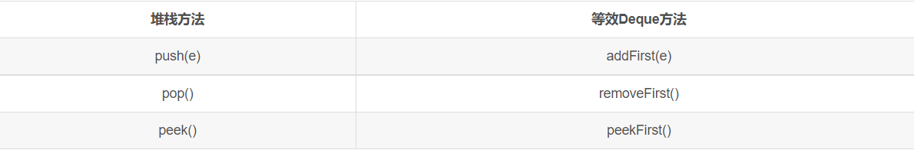
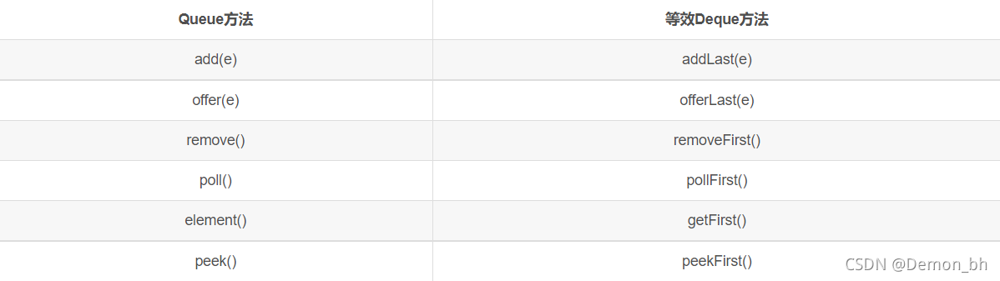

### 元素出口端一般定义为队头，入口端一般定义为队尾
---
# Stack
遵从FILO原则，先进后出，**所以peek的是栈头元素，pop的是栈头元素**。一切操作都是在栈头进行的。（开口部分为栈头）
- push(E e)：将元素压入栈顶
- pop()：将栈顶元素弹出
- peek()：查看栈顶元素
- empty()：判断栈是否为空
```java
Stack<Integer> stack=new Stack<>();
stack.push(1);
stack.push(2);
stack.push(3);
stack.peek();     //3
stack.pop();     //3
```
# Queue
>队列是一种特殊的线性表，它只允许在表的前端进行删除操作，而在表的后端进行插入操作。
1. 队列通常但不一定是以FIFO（先进先出）方式排序元素。 除了优先级队列之外，优先级队列是根据提供的**比较器**对元素进行排序，还是元素的自然排序，以及对元素LIFO（先进先出）进行排序的LIFO队列（或堆栈）。 
2. 无论使用什么顺序，**队列的头**都是通过调用remove()或poll()删除的元素。 在一个FIFO队列，所有新元素插入到队列的尾部 。 其他类型的队列可以使用不同的布局规则。 每个Queue实现必须指定其排序属性。 
3. 若遵从FIFO原则，**那么offer的是队尾元素，poll的是队头元素**。（从右到左）
### queue中增删方法的区别
 java Queue中 add/offer，element/peek，remove/poll中的三个方法均为重复的方法
1. add()和offer()区别:
>add()和offer()都是向队列中添加一个元素。一些队列有大小限制，因此如果想在一个满的队列中加入一个新项，调用 add() 方法就会抛出一个 unchecked 异常，而调用 offer() 方法会返回 false。因此就可以在程序中进行有效的判断！

1. poll()和remove()区别：
>remove() 和 poll() 方法都是从队列中删除第一个元素。如果队列元素为空，调用remove() 的行为与 Collection 接口的版本相似会抛出异常，但是新的 poll() 方法在用空集合调用时只是返回 null。因此新的方法更适合容易出现异常条件的情况。

1. element() 和 peek() 区别：
>element() 和 peek() 用于在队列的头部查询元素。与 remove() 方法类似，在队列为空时， element() 抛出一个异常，而 peek() 返回 null。

下面是Java中Queue的一些常用方法：
```markdown
add         增加一个元索                      如果队列已满，则抛出一个IIIegaISlabEepeplian异常
remove   移除并返回队列头部的元素     如果队列为空，则抛出一个NoSuchElementException异常
element  返回队列头部的元素              如果队列为空，则抛出一个NoSuchElementException异常
offer       添加一个元素并返回true        如果队列已满，则返回false
poll         移除并返问队列头部的元素     如果队列为空，则返回null
peek       返回队列头部的元素              如果队列为空，则返回null
put         添加一个元素                       如果队列满，则阻塞
take        移除并返回队列头部的元素     如果队列为空，则阻塞
```
### 代码示例
```java
import java.util.LinkedList;
import java.util.Queue;
 
public class Main {
    public static void main(String[] args) {
        //add()和remove()方法在失败的时候会抛出异常(不推荐)
        Queue<String> queue = new LinkedList<String>();
        //添加元素
        queue.offer("a");
        queue.offer("b");
        queue.offer("c");
        queue.offer("d");
        queue.offer("e");
        for(String q : queue){
            System.out.println(q);
        }
        System.out.println("===");
        System.out.println("poll="+queue.poll()); //返回第一个元素，并在队列中删除
        for(String q : queue){
            System.out.println(q);
        }
        System.out.println("===");
        System.out.println("element="+queue.element()); //返回第一个元素 
        for(String q : queue){
            System.out.println(q);
        }
        System.out.println("===");
        System.out.println("peek="+queue.peek()); //返回第一个元素 
        for(String q : queue){
            System.out.println(q);
        }
    }
}
```
# 用Deque模拟Stack
1. deque是一个双端队列double ended queue（双端队列）
2. 实现了传统stack的基础方法。方法等价 (**仍然可以使用原本的stack方法名**)
   1. push(e) addFirst(e)
   2. pop() removeFirst()
   3. peek() peekFirst() 
   4. isEmpty()方法仍能使用
   
```java
// 用Deque模拟Stack
Deque<Integer> stack = new LinkedList<>();
stack.push(0);
for (int i=1;i<len;i++){
    while (!stack.isEmpty() && temperatures[i]>temperatures[stack.peek()]){
        res[stack.peek()] = i-stack.peek();
        stack.pop();
    }
    stack.push(i);
}
```
# 用Deque模拟Queue
1. deque是一个双端队列double ended queue（双端队列）
2. 展了Queue接口。当使用deque作为队列时，FIFO（先进先出）行为的结果。 **元素将添加到deque的末尾，并从头开始删除**。
3. 方法等价
   1. add(e) addLast(e)
   2. offer(e) offerLast(e)
   3. remove() removeFirst()
   4. poll() pollFirst()
   5. element() getFirst()
   6. peek() peekFirst() 
   7. 
```java
Deque<Integer> deque = new LinkedList<>();
```